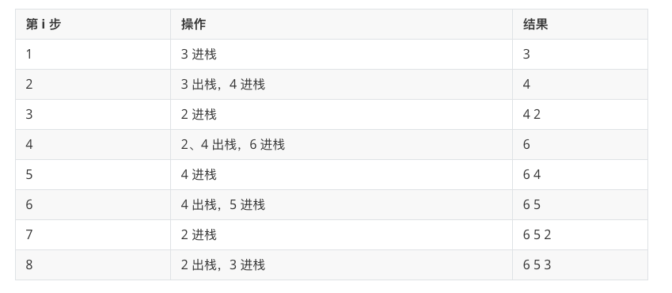

# 单调栈

### 栈

性质就是：先进后出 

### 单调栈 

是在栈的 先进后出 基础之上额外添加一个特性：从栈顶到栈底的元素是严格递增（or递减）。

#### 单调栈的性质：

1. 单调栈里的元素具有单调性
2. 元素加入栈前，会在栈顶端把破坏栈单调性的元素都删除
3. 使用单调栈可以找到元素向左遍历第一个比他小的元素，也可以找到元素向左遍历第一个比他大的元素。
4. 时间复杂度:O(n)，因为所有元素只会进入栈一次，并且出栈后再也不会进栈了

#### 进栈过程原理：

- 对于单调递增栈，若当前进栈元素为 e，从栈顶开始遍历元素，把小于 e 或者等于 e 的元素弹出栈，直接遇到一个大于 e 的元素或者栈为空为止，然后再把 e 压入栈中。
- 对于单调递减栈，则每次弹出的是大于 e 或者等于 e 的元素。

#### 进栈过程举例：

现在有一组数 

`3，4，2，6，4，5，2，3`

让它们从左到右依次入栈。

具体过程如下：


#### 题目

```
> 每日温度
请根据每日 气温 列表，重新生成一个列表。对应位置的输出为：要想观测到更高的气温，至少需要等待的天数。如果气温在这之后都不会升高，请在该位置用 0 来代替。

例如，给定一个列表 temperatures = [73, 74, 75, 71, 69, 72, 76, 73]，你的输出应该是 [1, 1, 4, 2, 1, 1, 0, 0]。

提示：气温 列表长度的范围是 [1, 30000]。每个气温的值的均为华氏度，都是在 [30, 100] 范围内的整数。

```

```python
class Solution:
    def dailyTemperatures(self, T: List[int]) -> List[int]:
        # 可以维护一个存储下标的单调栈，从栈底到栈顶的下标对应的温度列表中的温度依次递减。
        # 如果一个下标在单调栈里，则表示尚未找到下一次温度更高的下标。
        ans = [0] * len(T)
        stack = []
        for i in range(len(T)):
            while stack and T[stack[-1]] < T[i]:    # 栈不为空 && 栈顶温度小于当前温度
                ans[stack[-1]] = i - stack[-1]
                stack.pop()
            stack.append(i)
            print("end",ans,stack)
        return ans

----
output

end [0, 0, 0, 0, 0, 0, 0, 0] [0]
end [1, 0, 0, 0, 0, 0, 0, 0] [1]
end [1, 1, 0, 0, 0, 0, 0, 0] [2]
end [1, 1, 0, 0, 0, 0, 0, 0] [2, 3]
end [1, 1, 0, 0, 0, 0, 0, 0] [2, 3, 4]
end [1, 1, 0, 2, 1, 0, 0, 0] [2, 5]
end [1, 1, 4, 2, 1, 1, 0, 0] [6]
end [1, 1, 4, 2, 1, 1, 0, 0] [6, 7]
[1, 1, 4, 2, 1, 1, 0, 0]
```


