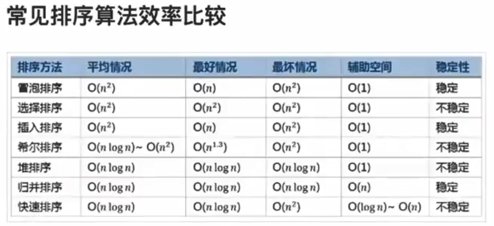

# 排序

### 简单排序

- 直接排序  o(n^2)
    > 从左到右
- 冒泡排序  o(n^2)
    > 从右向左：每一趟在相邻两个元素种选出一个最大值，排在最后一个
- 选择排序  o(n^2)
    > 每一趟选出一个最小值，放到前面
- 插入排序  o(n^2)
    > 不断地从后面选一个数，然后插入到前面已经有序的序列里
- 希尔排序  o(nlogn) ~ o(n^2)
    > 是一种分组插入排序算法

```python
# 直接排序 o(n^2)
def sort(list):
    n = len(list)
    for i in range(n-1):
        for j in range(i+1,n):
            if list[i]>list[j]:
                list[i],list[j] = list[j],list[i]
    return list

# 冒泡 o(n^2)
def bubbleSort(list):
    n = len(list)
    for i in range(n-1):            # 该层循环控制 需要冒泡的轮数
        for j in range(n-1,i,-1):   # 每一趟选出一个最大值，排在最后一个
            if list[j-1] >list[j]:
                list[j-1],list[j] = list[j],list[j-1]
    return list

```

### 高级排序

- 快排  o(nlogn)
    > 指定第一个数为mid_value,排序使得mid_value左边的数比mid_value小，右边的数比mid_value大，然后分别对左边和右边进行递归排序。
- 归并排序  o(nlogn)
    > 拆分到单个元素，然后两个两个往上进行递归合并。设置left 和right两个游标,进行合并。
- 堆排序    o(nlogn)
    > 构造堆：从小堆到大堆，先看最后一个非叶子节点，从下往上

```python
# 快排 o(nlogn)
def quickSort(list):
    # 先判断是否需要继续进行
    n = len(list);
    if n<=1:
        return list
    # 选择第一个元素作为基准
    base = list[0]
    # 遍历除了基准外的所有元素，按照大小关系放入两个数组内
    left = []
    right = []
    for i in range(1,n):
        if base > list[i]:
            left.append(list[i])
        else:
            right.append(list[i])
    # 分别对左边和右边的数组进行相同的排序处理方式递归调用这个函数
    left = quickSort(left)
    right = quickSort(right)
    # 合并
    return left+[base]+right

```

### 总结


